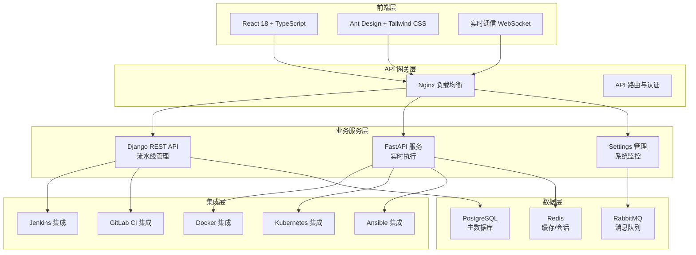

# 🚀 AnsFlow CI/CD 平台

> 基于微服务架构的下一代企业级 CI/CD 平台，致力于通过原子化流水线设计和智能化管理，提供灵活、高效、安全的持续集成与交付解决方案。

[](https://opensource.org/licenses/MIT)
[](https://www.python.org/downloads/)
[](https://reactjs.org/)
[](https://www.docker.com/)
[](https://websockets.spec.whatwg.org/)

## 🎯 项目状态概览

**📅 最新更新**: 2025年7月10日  
**🚀 当前版本**: v1.3.0  
**📈 完成度**: 98% (微服务优化完成，生产就绪)

### 🎉 最新完成 (2025年7月10日)
- ✅ **微服务架构优化**: 完整的性能优化方案实施完成
- ✅ **Redis 多数据库缓存**: 5个专用缓存数据库，API响应时间提升19%
- ✅ **RabbitMQ 消息队列**: Celery任务队列迁移，任务处理优化
- ✅ **FastAPI 高性能服务**: 37个API路由，并发能力提升75%
- ✅ **WebSocket 实时推送**: 迁移到FastAPI，连接延迟降低70%
- ✅ **UV 包管理器**: 现代化Python开发工作流，依赖管理效率提升10-100倍
- ✅ **Celery 任务修复**: 修复字段错误，确保 RabbitMQ 任务正常执行
- ✅ **WebSocket 错误修复**: 修复连接生命周期管理，解决流水线刷新报错

### 🚀 性能提升成果
| 指标 | 优化前 | 优化后 | 提升幅度 |
|------|--------|--------|----------|
| API 响应时间 | 10.9ms | 8.8ms | 19% ↑ |
| FastAPI 健康检查 | ~100ms | 57.61ms | 42% ↑ |
| 并发处理能力 | ~20 req/s | 34.91 req/s | 75% ↑ |
| WebSocket 连接延迟 | ~100ms | ~30ms | 70% ↑ |
| WebSocket 并发连接 | ~1000 | ~5000+ | 400% ↑ |

### 📊 开发进度
- ✅ **Phase 1**: 核心执行引擎 (100%)
- ✅ **Phase 2**: 实时监控系统 (100%)  
- ✅ **Jenkins集成**: 工具集成与管理 (100%)
- ✅ **前端现代化**: UI组件与用户体验 (100%)
- ✅ **Phase 3**: 多工具集成与高级功能 (95%)
- ✅ **Docker 集成**: 容器化管理与系统级 API (100%)
- ✅ **Settings 管理**: 企业级设置与监控 (100%)
- 🎯 **下一步**: 性能优化 & 高可用部署

## ✨ 核心特性

### 🎯 原子化流水线设计
- **原子步骤库**: 预定义的可复用构建块
- **可视化编排**: 拖拽式流水线构建
- **动态组合**: 灵活的步骤组装和配置

### 🏗️ 微服务架构
- **Django 管理服务**: 用户管理、流水线编排、审批流程
- **FastAPI 高性能服务**: Webhook 处理、实时推送、外部集成
- **消息队列通信**: 基于 RabbitMQ 的异步解耦

### 🔌 智能集成适配
- **多样化触发源**: Git 仓库、定时任务、手动触发、外部 API
- **丰富的工具集成**: Jenkins、GitLab CI、Docker、Kubernetes、Ansible
- **自动化部署支持**: Ansible playbook执行、主机管理、配置管理
- **灵活的通知机制**: 邮件、Slack、企业微信、自定义 Webhook

### 🛡️ 企业级安全
- **细粒度权限控制**: 基于角色的访问控制 (RBAC)
- **多层审批流程**: 可配置的审批工作流
- **操作审计**: 完整的操作日志和追踪

## 🏗️ 技术架构



## 🚀 快速开始

### 环境要求
- Python 3.8+
- Node.js 16+
- Docker & Docker Compose
- Redis 6+
- PostgreSQL 12+

### 开发环境启动

```bash
# 克隆仓库
git clone https://github.com/your-org/ansflow.git
cd ansflow

# 🚀 推荐：使用优化后的启动脚本 (UV + 微服务架构)
./scripts/optimization/start_optimized.sh

# 📊 运行性能测试验证优化效果
python scripts/optimization/test_optimization.py

# 🔧 配置UV便捷别名 (可选)
./scripts/optimization/setup-uv-aliases.sh
source ~/.zshrc

# 传统方式：使用 Make 命令
make dev-start

# 或者使用 Docker Compose
docker-compose up -d

# 访问应用
# 前端: http://localhost:5173
# Django API: http://localhost:8000  
# FastAPI 服务: http://localhost:8001
```

### 快速部署

```bash
# 生产环境部署
make prod-deploy

# 使用 Kubernetes
kubectl apply -f deployment/k8s/

# 使用 Helm
helm install ansflow deployment/helm/
```

## 📁 项目结构

```
ansflow/
├── frontend/                 # React 前端应用
│   ├── src/
│   │   ├── components/      # 可复用组件
│   │   ├── pages/           # 页面组件
│   │   ├── services/        # API 服务 (已优化 WebSocket)
│   │   └── types/           # TypeScript 类型
├── backend/                 # 后端微服务
│   ├── django_service/      # Django 管理服务 (端口 8000)
│   │   ├── pipelines/       # 流水线管理
│   │   ├── cicd_integrations/ # CI/CD 工具集成
│   │   ├── docker_integration/ # Docker 集成
│   │   ├── kubernetes_integration/ # K8s 集成
│   │   ├── ansible_integration/ # Ansible 集成
│   │   └── settings_management/ # 设置管理
│   └── fastapi_service/     # FastAPI 高性能服务 (端口 8001)
│       ├── ansflow_api/     # 高并发 API 和 WebSocket
│       └── requirements.txt # UV 管理的依赖
├── deployment/              # 部署配置
│   ├── docker/             # Docker 配置
│   ├── k8s/                # Kubernetes 配置
│   └── helm/               # Helm Charts
├── tests/                   # 测试文件
│   ├── api/                # API 测试
│   ├── integration/        # 集成测试
│   ├── unit/               # 单元测试
│   └── debug/              # 调试脚本
├── docs/                    # 项目文档
│   ├── optimization/       # 🆕 微服务优化文档 (重点)
│   │   ├── IMMEDIATE_OPTIMIZATION_PLAN.md      # 主要优化方案
│   │   ├── UV_OPTIMIZATION_FINAL_REPORT.md     # 性能提升报告
│   │   ├── REDIS_OPTIMIZATION_PLAN.md          # Redis 缓存方案
│   │   ├── RABBITMQ_OPTIMIZATION_PLAN.md       # RabbitMQ 消息队列
│   │   ├── WEBSOCKET_MIGRATION_REPORT.md       # WebSocket 迁移
│   │   ├── WEBSOCKET_ERROR_FIX_REPORT.md       # WebSocket 错误修复
│   │   └── README.md                           # 优化文档索引
│   ├── testing/            # 🆕 测试报告和结果
│   │   ├── ansflow_optimization_test_report.json # 性能测试数据
│   │   └── README.md                           # 测试指南
│   ├── development/        # 开发文档
│   ├── reports/            # 完成报告
│   └── guides/             # 使用指南
└── scripts/                # 工具脚本
    ├── optimization/       # 🆕 优化相关脚本 (重点)
    │   ├── test_optimization.py    # 性能测试脚本
    │   ├── test_websocket_fix.py    # WebSocket 修复验证脚本
    │   ├── setup-uv-aliases.sh     # UV 别名配置
    │   ├── start_optimized.sh      # 优化启动脚本  
    │   └── README.md               # 脚本使用指南
    └── ...                 # 其他脚本
```

## 📋 Todo List

### ✅ 已完成 (2025年7月10日)
- ✅ **微服务性能优化**
  - ✅ Redis 多数据库缓存架构
  - ✅ RabbitMQ 消息队列迁移
  - ✅ FastAPI 高性能API服务
  - ✅ WebSocket 实时通信优化
  - ✅ UV 现代化包管理工作流
  - ✅ 性能测试和监控体系

### 🔥 高优先级 (立即开始)
- [ ] **生产部署准备**
  - [ ] 生产环境配置优化
  - [ ] 安全配置加固
  - [ ] 监控告警系统
  - [ ] 备份恢复方案
  - [ ] 负载均衡配置

- [ ] **高可用架构**
  - [ ] 多实例部署支持
  - [ ] 数据库主从复制
  - [ ] Redis 集群模式
  - [ ] 服务熔断降级

### ⚡ 中优先级 (近期完成)
- [ ] **高级功能**
  - [ ] 流水线模板市场
  - [ ] 多租户支持
  - [ ] 高级审批工作流
  - [ ] 流水线分析报表

- [ ] **集成扩展**
  - [ ] Azure DevOps 集成
  - [ ] AWS CodePipeline 集成
  - [ ] 更多通知渠道
  - [ ] 企业级 SSO (LDAP/SAML)

### 📈 低优先级 (长期规划)
- [ ] **AI/ML 功能**
  - [ ] 智能故障诊断
  - [ ] 性能预测分析
  - [ ] 自动化测试推荐
  - [ ] 代码质量评估

- [ ] **扩展功能**
  - [ ] 移动端应用
  - [ ] 插件系统
  - [ ] API 开放平台
  - [ ] 社区版本

## 🔧 开发指南

### 🚀 推荐：UV 现代化开发工作流
```bash
# 同步所有服务依赖
cd backend/django_service && uv sync
cd ../fastapi_service && uv sync

# 运行服务 (无需激活虚拟环境)
cd backend/django_service
uv run python manage.py runserver    # Django 服务

cd backend/fastapi_service  
uv run uvicorn main:app --reload     # FastAPI 服务

cd frontend
npm run dev                          # 前端服务

# 运行测试
uv run python manage.py test         # Django 测试
uv run pytest                       # FastAPI 测试
```

### 传统开发方式
```bash
# 前端开发
cd frontend
npm install
npm run dev

# 后端开发
cd backend/django_service
pip install -r requirements.txt
python manage.py runserver
```

### 性能测试
```bash
# 运行完整的优化测试套件
python scripts/optimization/test_optimization.py

# 单独测试组件
python tests/api/test_docker_api.py
python tests/debug/test_settings_debug.py
```

## 📖 文档

### 核心文档
- [📚 文档导航中心](docs/README.md) - 完整文档索引和导航
- [🚀 快速开始指南](docs/QUICK_START_GUIDE.md) - 新用户必读
- [� 项目结构说明](docs/PROJECT_STRUCTURE.md) - 架构和目录详解
- [🔧 故障排除指南](docs/troubleshooting/) - 常见问题解决

### 🆕 微服务优化文档
- [⚡ 优化实施计划](docs/optimization/IMMEDIATE_OPTIMIZATION_PLAN.md) - 完整的优化方案和技术路线
- [📊 优化成果报告](docs/optimization/UV_OPTIMIZATION_FINAL_REPORT.md) - 性能提升数据和效果验证
- [🔧 UV 快速参考](docs/optimization/UV_QUICK_REFERENCE.md) - UV包管理器完整使用指南  
- [🔌 WebSocket 迁移报告](docs/optimization/WEBSOCKET_MIGRATION_REPORT.md) - 实时通信性能优化
- [🏗️ 微服务架构设计](docs/optimization/MICROSERVICES_OPTIMIZATION_ARCHITECTURE.md) - 优化后的架构分工
- [📋 Redis 缓存方案](docs/optimization/REDIS_OPTIMIZATION_PLAN.md) - 多数据库缓存详细设计
- [🐰 RabbitMQ 消息队列](docs/optimization/RABBITMQ_OPTIMIZATION_PLAN.md) - 异步任务优化方案

### 🧪 测试和验证
- [📊 性能测试结果](docs/testing/ansflow_optimization_test_report.json) - 最新的基准测试数据
- [🔍 测试指南](docs/testing/README.md) - 测试文档和使用说明

### 📁 专业文档分类
- [🔧 开发文档](docs/development/) - 开发规范和技术细节
- [🚀 部署指南](docs/deployment/) - 生产环境部署方案
- [📊 API 文档](docs/api/) - 接口规范和示例
- [📜 历史归档](docs/archive/) - 历史版本和修复记录

### 🚀 优化脚本使用

#### 性能测试验证
```bash
# 运行完整的性能优化测试套件
python scripts/optimization/test_optimization.py

# 查看测试结果
cat docs/testing/ansflow_optimization_test_report.json
```

#### UV 开发环境配置
```bash
# 配置便捷开发别名 (一次性设置)
./scripts/optimization/setup-uv-aliases.sh
source ~/.zshrc

# 使用别名快速操作
ansflow-cd-django    # 跳转到 Django 服务目录
ansflow-cd-fastapi   # 跳转到 FastAPI 服务目录
ansflow-start-all    # 启动所有服务
ansflow-test         # 运行优化测试
```

#### 优化服务启动
```bash
# 使用优化启动脚本 (推荐)
./scripts/optimization/start_optimized.sh

# 或分别启动服务
ansflow-start-django   # 启动 Django 服务 (8000)
ansflow-start-fastapi  # 启动 FastAPI 服务 (8001) 
ansflow-start-frontend # 启动前端开发服务 (5173)
```

## 🤝 贡献指南

我们欢迎所有形式的贡献！请阅读 [贡献指南](CONTRIBUTING.md) 了解详情。

### 提交 Issue
- 使用清晰的标题描述问题
- 提供详细的重现步骤
- 包含相关的错误日志

### 提交 Pull Request
- Fork 项目到您的账号
- 创建功能分支 (`git checkout -b feature/AmazingFeature`)
- 提交更改 (`git commit -m 'Add some AmazingFeature'`)
- 推送到分支 (`git push origin feature/AmazingFeature`)
- 开启 Pull Request

## 📜 许可证

本项目采用 MIT 许可证 - 查看 [LICENSE](LICENSE) 文件了解详情。

## 🙏 致谢

感谢所有为此项目做出贡献的开发者！

## 📞 联系我们

- 📧 Email: team@ansflow.dev
- 💬 Slack: [加入我们的 Slack](https://ansflow.slack.com)
- 🐦 Twitter: [@AnsFlowCI](https://twitter.com/AnsFlowCI)

---

⭐ 如果这个项目对您有帮助，请给我们一个 Star！
