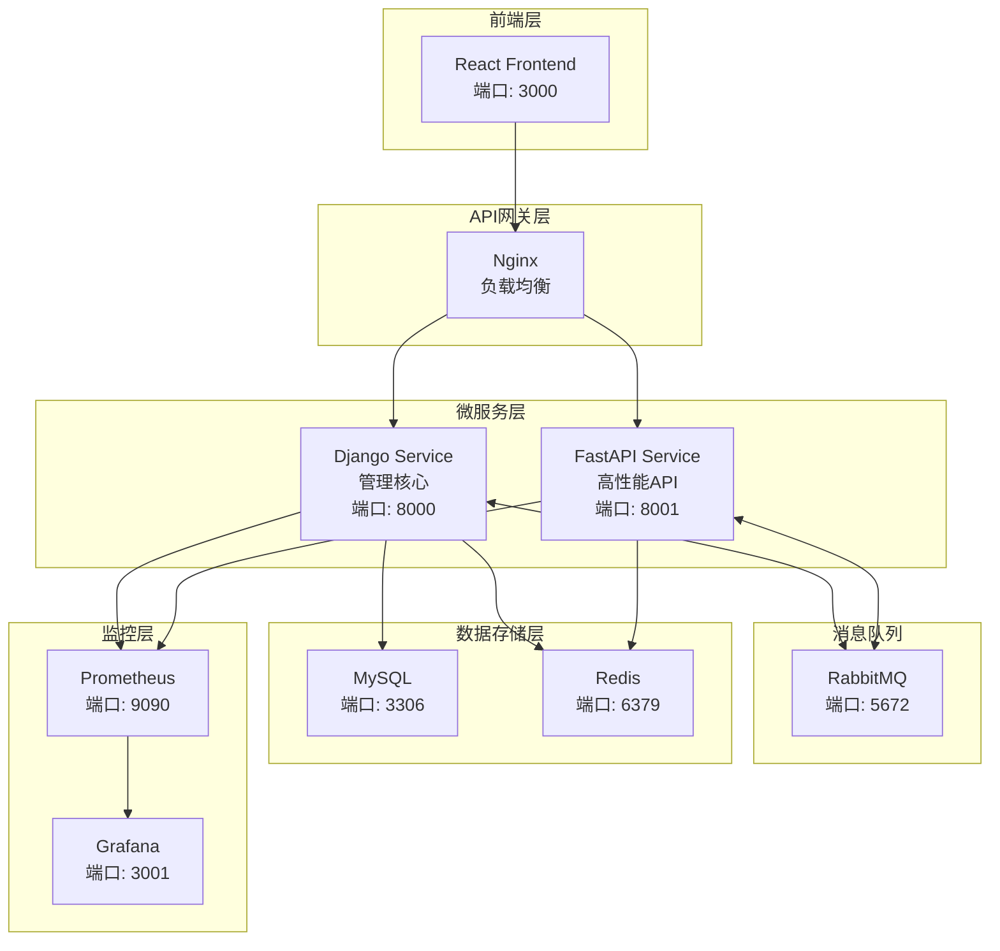

# 🚀 AnsFlow CI/CD 平台

> 基于微服务架构的下一代企业级 CI/CD 平台，致力于通过原子化流水线设计和智能化管理，提供灵活、高效、安全的持续集成与交付解决方案。

[](https://opensource.org/licenses/MIT)
[](https://www.python.org/downloads/)
[](https://reactjs.org/)
[](https://www.docker.com/)
[](https://websockets.spec.whatwg.org/)

## 🎯 项目状态概览

**📅 最新更新**: 2025年7月8日  
**🚀 当前版本**: v1.2.0  
**📈 完成度**: 85% (核心功能完善，生产就绪)

### 📊 开发进度
- ✅ **Phase 1**: 核心执行引擎 (100%)
- ✅ **Phase 2**: 实时监控系统 (100%)  
- ✅ **Jenkins集成**: 工具集成与管理 (100%)
- ✅ **前端现代化**: UI组件与用户体验 (100%)
- 🚧 **Phase 3**: 多工具集成与高级功能 (60%)
- 🎯 **下一步**: Ansible深度集成 & Docker容器化

## ✨ 核心特性

### 🎯 原子化流水线设计
- **原子步骤库**: 预定义的可复用构建块
- **可视化编排**: 拖拽式流水线构建
- **动态组合**: 灵活的步骤组装和配置

### 🏗️ 微服务架构
- **Django 管理服务**: 用户管理、流水线编排、审批流程
- **FastAPI 高性能服务**: Webhook 处理、实时推送、外部集成
- **消息队列通信**: 基于 RabbitMQ 的异步解耦

### 🔌 智能集成适配
- **多样化触发源**: Git 仓库、定时任务、手动触发、外部 API
- **丰富的工具集成**: Jenkins、GitLab CI、Docker、Kubernetes、Ansible
- **自动化部署支持**: Ansible playbook执行、主机管理、配置管理
- **灵活的通知机制**: 邮件、Slack、企业微信、自定义 Webhook

### 🛡️ 企业级安全
- **细粒度权限控制**: 基于角色的访问控制 (RBAC)
- **多层审批流程**: 可配置的审批工作流
- **操作审计**: 完整的操作日志和追踪

## 🏗️ 技术架构



## 🚀 快速开始

### 环境要求
- **Docker**: 20.10+
- **Docker Compose**: 2.0+
- **Node.js**: 16+ (本地开发)
- **Python**: 3.8+ (本地开发)

### 一键启动

```bash
# 1. 克隆项目
git clone https://github.com/your-org/ansflow.git
cd ansflow

# 2. 复制环境变量配置
cp .env.example .env

# 3. 启动开发环境
make dev-up

# 4. 初始化数据库
make db-init

# 5. 创建超级用户
make superuser

# 6. 验证系统状态 (可选)
./scripts/check_system_status.sh    # 完整系统检查
python scripts/quick_verify.py      # 快速功能验证
```

### 访问服务

| 服务 | URL | 说明 |
|------|-----|------|
| 🎨 前端界面 | http://localhost:3000 | React 用户界面 |
| 🔧 Django 管理 | http://localhost:8000/admin | 后台管理界面 |
| ⚡ FastAPI 文档 | http://localhost:8001/docs | API 接口文档 |
| 🐰 RabbitMQ 管理 | http://localhost:15672 | 消息队列监控 |
| 📊 Grafana 监控 | http://localhost:3001 | 系统监控面板 |

**默认登录凭据**: admin / admin123

> 💡 **提示**: 首次启动建议运行 `./scripts/check_system_status.sh` 验证所有服务正常运行

## 📋 功能实现状态

### ✅ 已完成功能

#### 🔧 核心架构 (100%)
- ✅ **微服务架构**: Django + FastAPI + React + Celery 完整集成
- ✅ **数据库系统**: MySQL + Redis 数据存储和缓存
- ✅ **消息队列**: RabbitMQ 异步任务处理
- ✅ **实时通信**: WebSocket 实时状态推送 (<100ms延迟)

#### 🎨 前端界面 (95%)
- ✅ **现代化UI**: Ant Design + React 18 + TypeScript
- ✅ **响应式布局**: 移动端友好的自适应设计
- ✅ **拖拽编辑器**: 可视化流水线步骤配置
- ✅ **执行监控**: 实时执行状态和日志展示
- ✅ **统计仪表板**: Executions页面统计卡片和数据展示

#### 🔌 工具集成 (90%)
- ✅ **Jenkins集成**: 完整的作业管理、构建监控、日志查看
- ✅ **Ansible集成**: Playbook执行、主机管理、自动化部署
- ✅ **Git凭据管理**: 多种认证方式，安全密钥存储
- ✅ **工具状态系统**: 智能健康检查和状态监控

#### ⚙️ 执行引擎 (95%)
- ✅ **7种原子步骤**: build、test、deploy、fetch_code、security_scan、notify、ansible
- ✅ **Celery异步执行**: 后台任务处理和监控
- ✅ **执行模式**: 本地执行、远程执行、混合执行
- ✅ **状态同步**: 实时步骤状态更新和历史记录

#### 🛡️ 安全与权限 (80%)
- ✅ **JWT认证**: 前端Token自动续期和认证
- ✅ **密钥管理**: 加密存储和安全访问
- ✅ **操作审计**: 完整的操作日志记录
- 🔄 **RBAC权限**: 基础权限控制 (待完善)

### 🚧 进行中功能

#### 📊 监控与分析 (60%)
- 🔄 **高级仪表板**: Charts.js集成的趋势分析
- 🔄 **性能监控**: 系统资源使用监控
- 🔄 **告警系统**: 失败通知和邮件/Slack集成

#### 🔗 多工具扩展 (40%)
- 🔄 **GitLab CI集成**: 基于适配器模式的扩展
- 🔄 **GitHub Actions**: 工作流管理和状态同步  
- 🔄 **Docker集成**: 容器构建和镜像管理

#### 🚀 高级功能 (30%)
- 🔄 **条件分支**: 基于条件的流水线分支执行
- 🔄 **并行执行**: 多任务并行处理能力
- 🔄 **审批工作流**: 多级审批和人工干预节点

### ⏳ 计划中功能

#### 🏢 企业级特性
- [ ] **多租户架构**: 企业级多组织管理
- [ ] **高级权限**: 细粒度RBAC权限控制
- [ ] **API网关**: 统一API管理和限流
- [ ] **数据备份**: 自动化备份和恢复策略

#### 🤖 智能化功能  
- [ ] **流水线推荐**: 基于项目类型的智能推荐
- [ ] **异常检测**: AI驱动的问题检测和修复建议
- [ ] **性能预测**: 基于历史数据的趋势预测
- [ ] **资源调度**: 动态资源分配和优化

## 🎯 下一步开发计划

### 📅 近期计划 (未来4周)

#### Week 1-2: Ansible深度集成完善
- 🎯 **优先级1**: 基于已有基础，完善Ansible功能
  - [ ] Ansible inventory文件上传和版本管理
  - [ ] 主机组管理和SSH认证配置优化  
  - [ ] 实时执行监控和详细日志展示
  - [ ] 模板化部署流程和最佳实践

#### Week 3-4: Docker容器化集成
- 🎯 **优先级2**: 容器化工具链集成
  - [ ] 本地Docker容器构建和镜像管理
  - [ ] Docker Registry集成和版本控制
  - [ ] 容器部署步骤类型和监控

### 📅 中期计划 (未来8周)

#### Week 5-6: 监控与分析增强  
- 📊 **系统监控**: 基于现有Executions页面扩展Charts.js集成
- 🔔 **告警通知**: 邮件/Slack集成和智能告警
- 📈 **执行分析**: 成功率趋势和性能分析报告

#### Week 7-8: 多工具生态扩展
- 🔌 **GitLab CI**: 基于Jenkins适配器模式扩展  
- 🔌 **GitHub Actions**: 工作流管理和状态同步
- 🔐 **权限系统**: RBAC模型和企业级权限管理

### 📅 长期规划 (未来6个月)

#### 企业级功能
- 🏢 **多租户架构**: 支持多组织和团队管理
- 🔒 **企业安全**: SSO、审计日志、合规性支持
- 📊 **高级报表**: KPI监控和业务指标分析

#### 智能化升级
- 🤖 **AI集成**: 流水线优化建议和异常预测
- 📈 **性能优化**: 大规模并发和资源调度
- 🔮 **预测分析**: 基于机器学习的趋势预测

## 📚 文档与资源

### 📖 快速上手
- [⚡ 快速启动指南](./docs/QUICK_START_GUIDE.md) - 5分钟快速体验
- [🏗️ 项目结构说明](./docs/PROJECT_STRUCTURE.md) - 了解项目架构
- [📊 项目状态总结](./docs/PROJECT_STATUS_SUMMARY.md) - 当前开发进展

### 🔧 开发文档
- [📡 API文档](./docs/api/) - REST API和WebSocket API
- [👨‍💻 开发指南](./docs/development/) - 开发规范和贡献指南
- [🚀 部署指南](./docs/deployment/) - 生产环境部署

### 🧪 测试工具
- [📋 脚本目录说明](./scripts/README.md) - 所有脚本的使用指南
- [📚 历史归档](./docs/archive/) - 修复报告和技术决策记录

## 🛠️ 开发指南

### 常用命令

```bash
# 开发环境管理
make dev-up          # 启动开发环境
make dev-down        # 停止开发环境  
make dev-restart     # 重启服务
make dev-logs        # 查看日志

# 数据库管理
make db-init         # 初始化数据库
make db-migrate      # 运行迁移
make db-seed         # 填充测试数据
make db-backup       # 备份数据库

# 测试相关
make test            # 运行所有测试
make test-backend    # 运行后端测试
make test-frontend   # 运行前端测试
make lint            # 代码检查

# 生产部署
make prod-deploy     # 生产环境部署
make prod-logs       # 生产环境日志
make prod-backup     # 生产环境备份
```

### 项目结构

```
ansflow/
├── 🔧 backend/                 # 后端微服务
│   ├── django_service/         # Django 管理服务
│   ├── fastapi_service/        # FastAPI 高性能服务
│   └── shared/                 # 共享代码库
├── 🎨 frontend/                # React 前端应用
├── 🚀 deployment/              # 部署配置
├── 📚 docs/                    # 项目文档
├── 🧪 tests/                   # 集成测试
├── 📊 monitoring/              # 监控配置
└── 🔧 scripts/                 # 工具脚本
```

## 🤝 贡献指南 （待功能完善之后开放）

我们欢迎社区贡献！请遵循以下步骤：

1. **Fork** 本仓库
2. 创建特性分支 (`git checkout -b feature/amazing-feature`)
3. 提交更改 (`git commit -m 'Add some AmazingFeature'`)
4. 推送到分支 (`git push origin feature/amazing-feature`)
5. 开启 **Pull Request**

### 开发规范
- 遵循 [PEP 8](https://www.python.org/dev/peps/pep-0008/) Python 代码规范
- 遵循 [ESLint](https://eslint.org/) JavaScript/TypeScript 代码规范
- 提交信息遵循 [Conventional Commits](https://www.conventionalcommits.org/)
- 确保所有测试通过
- 更新相关文档

## 📄 许可证

本项目基于 MIT 许可证开源 - 查看 [LICENSE](LICENSE) 文件了解详情。

## 🙏 致谢

感谢所有为 AnsFlow 项目做出贡献的开发者和社区成员！

---

**⚡ 让 CI/CD 更简单，让开发更高效 - AnsFlow 与您同行！**
