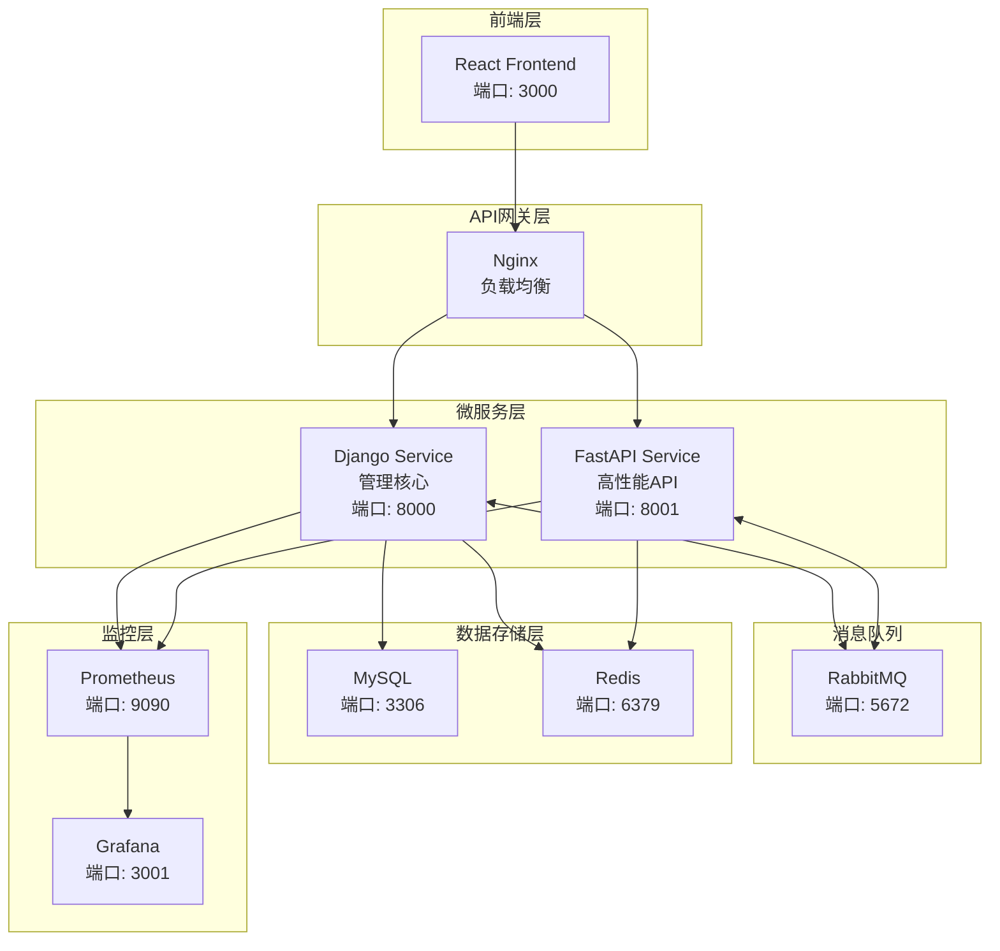

# 🚀 AnsFlow CI/CD 平台

> 基于微服务架构的下一代企业级 CI/CD 平台，致力于通过原子化流水线设计和智能化管理，提供灵活、高效、安全的持续集成与交付解决方案。

[](https://opensource.org/licenses/MIT)
[](https://www.python.org/downloads/)
[](https://reactjs.org/)
[](https://www.docker.com/)
[](https://websockets.spec.whatwg.org/)

## 🎯 当前项目状态 

**📅 最新更新**: 2025年7月8日 | **✅ 状态**: 前端现代化界面全面完成，Executions页面统计卡片优化，用户体验显著提升

### 最新修复内容
- ✅ **Executions页面现代化改造完成**: 全新的统计卡片展示，包括总执行次数、成功、失败、运行中、等待中等数据
- ✅ **统计卡片视觉优化**: 配色、圆角、阴影、图标等现代化设计，与全局风格统一
- ✅ **响应式布局完善**: 5个统计框在大屏下填满整行，消除右侧空白，移动端友好
- ✅ **搜索筛选功能**: 支持流水线名称搜索、状态筛选、时间范围过滤等高级功能
- ✅ **表格视觉提升**: 现代化状态标签、进度条、操作按钮等界面元素
- ✅ **前端UI组件统一**: Select组件样式、表格操作列、图标按钮等界面一致性完善
- ✅ **执行详情日志显示彻底修复**: 完全解决执行详情页面"查看全部"日志为空的问题
- ✅ **JWT Token过期处理**: 前端自动检测并更新过期的JWT Token，确保API调用始终有效
- ✅ **用户界面优化**: 清理调试信息，提供清洁的执行记录查看体验

### 项目进度概览
- ✅ **Phase 1 完成**: 核心执行引擎 (7种原子步骤，Celery异步执行)
- ✅ **Phase 2 完成**: WebSocket实时监控系统 (<100ms延迟，完整前后端集成)
- ✅ **Jenkins集成专项**: 工具状态系统、作业管理、构建监控、智能状态同步
- ✅ **前端现代化专项**: 执行记录页面统计卡片、UI组件统一、响应式布局优化
- ✅ **用户体验专项**: 执行详情页面显示修复、JWT认证优化、界面交互完善
- 🚧 **Phase 3 进行中**: 多CI/CD工具集成 + 高级工作流功能
- 🎯 **下一步**: Ansible自动化部署 & Docker容器化集成 (预计2周)

## ✨ 核心特性

### 🎯 原子化流水线设计
- **原子步骤库**: 预定义的可复用构建块
- **可视化编排**: 拖拽式流水线构建
- **动态组合**: 灵活的步骤组装和配置

### 🏗️ 微服务架构
- **Django 管理服务**: 用户管理、流水线编排、审批流程
- **FastAPI 高性能服务**: Webhook 处理、实时推送、外部集成
- **消息队列通信**: 基于 RabbitMQ 的异步解耦

### 🔌 智能集成适配
- **多样化触发源**: Git 仓库、定时任务、手动触发、外部 API
- **丰富的工具集成**: Jenkins、GitLab CI、Docker、Kubernetes、Ansible
- **自动化部署支持**: Ansible playbook执行、主机管理、配置管理
- **灵活的通知机制**: 邮件、Slack、企业微信、自定义 Webhook

### 🛡️ 企业级安全
- **细粒度权限控制**: 基于角色的访问控制 (RBAC)
- **多层审批流程**: 可配置的审批工作流
- **操作审计**: 完整的操作日志和追踪

## 🏗️ 技术架构



## 🚀 快速开始

> **⚡ 5分钟极速体验**: 查看 [快速启动指南](docs/QUICK_START_GUIDE.md) 获得最佳上手体验

### 📚 文档导航

- **📖 [完整文档目录](docs/README.md)** - 所有文档的总入口
- **🚀 [快速开始指南](docs/QUICK_START_GUIDE.md)** - 新用户5分钟上手
- **🏗️ [项目结构说明](docs/PROJECT_STRUCTURE.md)** - 了解项目架构
- **📊 [项目状态总结](docs/PROJECT_STATUS_SUMMARY.md)** - 当前开发进展
- **🔧 [快速修复指南](docs/QUICK_FIX_GUIDE.md)** - 常见问题解决
- **📡 [API文档](docs/api/)** - REST API和WebSocket API
- **🚀 [部署指南](docs/deployment/)** - 生产环境部署
- **👨‍💻 [开发指南](docs/development/)** - 开发规范和贡献指南
- **📚 [历史归档](docs/archive/)** - 所有修复报告和技术决策记录

### 🧪 测试和验证脚本

- **📋 [脚本目录说明](scripts/README.md)** - 所有脚本的使用指南
- **🎨 前端UI测试**: `node scripts/test_frontend_ui_optimization_july2_2025.js`
- **⚡ 快速验证**: `python scripts/quick_verify.py`
- **🔍 系统状态检查**: `./scripts/check_system_status.sh`
- **🔧 Jenkins集成测试**: `python scripts/jenkins_test_pipeline.py`
- **🛡️ 安全转义测试**: `python scripts/test_comprehensive_escaping.py`

### 环境要求

- **Docker**: 20.10+
- **Docker Compose**: 2.0+
- **Node.js**: 16+ (本地开发)
- **Python**: 3.8+ (本地开发)

### 一键启动

```bash
# 1. 克隆项目
git clone https://github.com/your-org/ansflow.git
cd ansflow

# 2. 复制环境变量配置
cp .env.example .env

# 3. 启动开发环境
make dev-up

# 4. 初始化数据库
make db-init

# 5. 创建超级用户
make superuser

# 6. 验证系统状态 (可选)
./scripts/check_system_status.sh    # 完整系统检查
python scripts/quick_verify.py      # 快速功能验证
```

### 访问服务

| 服务 | URL | 说明 |
|------|-----|------|
| 🎨 前端界面 | http://localhost:3000 | React 用户界面 |
| 🔧 Django 管理 | http://localhost:8000/admin | 后台管理界面 |
| ⚡ FastAPI 文档 | http://localhost:8001/docs | API 接口文档 |
| 🐰 RabbitMQ 管理 | http://localhost:15672 | 消息队列监控 |
| 📊 Grafana 监控 | http://localhost:3001 | 系统监控面板 |

默认登录凭据：
- **用户名**: admin
- **密码**: admin123

> 💡 **提示**: 首次启动建议运行 `./scripts/check_system_status.sh` 验证所有服务正常运行

## 📚 项目结构

```
ansflow/
├── 🔧 backend/                 # 后端微服务
│   ├── django_service/         # Django 管理服务
│   ├── fastapi_service/        # FastAPI 高性能服务
│   └── shared/                 # 共享代码库
├── 🎨 frontend/                # React 前端应用
├── 🚀 deployment/              # 部署配置
│   ├── docker/                 # Docker 配置
│   ├── kubernetes/             # K8s 部署配置
│   ├── terraform/              # 基础设施即代码
│   └── ansible/                # 配置管理
├── 📚 docs/                    # 项目文档
├── 🧪 tests/                   # 集成测试
├── 📊 monitoring/              # 监控配置
└── 🔧 scripts/                 # 工具脚本
```

详细结构说明请参考 [PROJECT_STRUCTURE.md](./PROJECT_STRUCTURE.md)

## 🛠️ 开发指南

### 后端开发

```bash
# 进入 Django 服务目录
cd backend/django_service

# 安装依赖
pip install -r requirements.txt

# 运行开发服务器
python manage.py runserver 8000

# 运行测试
python manage.py test
```

### 前端开发

```bash
# 进入前端目录
cd frontend

# 安装依赖
npm install

# 启动开发服务器
npm run dev

# 运行测试
npm run test

# 构建生产版本
npm run build
```

### 常用命令

```bash
# 开发环境管理
make dev-up          # 启动开发环境
make dev-down        # 停止开发环境
make dev-logs        # 查看日志
make dev-restart     # 重启服务

# 数据库管理
make db-init         # 初始化数据库
make db-migrate      # 运行迁移
make db-seed         # 填充测试数据
make db-backup       # 备份数据库

# 测试相关
make test            # 运行所有测试
make test-backend    # 运行后端测试
make test-frontend   # 运行前端测试
make lint            # 代码检查

# 生产部署
make prod-deploy     # 生产环境部署
make prod-logs       # 生产环境日志
make prod-backup     # 生产环境备份
```

## 📋 开发路线图 / TODO List

### 🎉 最新完成：前端现代化界面与用户体验优化 ✅
**完成日期**: 2025年7月8日 | **阶段**: 用户界面现代化与体验提升专项
- ✅ **Executions页面全面改造** - 新增顶部统计卡片，展示总执行次数、成功、失败、运行中、等待中数据
- ✅ **统计卡片现代化设计** - 配色、圆角、阴影、图标等视觉元素优化，与全局风格统一
- ✅ **响应式布局完善** - 5个统计框在大屏下等宽分布填满整行，消除空白，移动端友好
- ✅ **搜索筛选功能增强** - 支持流水线名称搜索、状态筛选、时间范围过滤、导出等功能
- ✅ **表格视觉现代化** - 状态标签、进度条、操作按钮等界面元素全面提升
- ✅ **UI组件一致性统一** - Select组件样式、表格操作列、图标按钮等界面标准化
- ✅ **执行详情页面修复** - 日志显示、JWT认证、API调用等功能完善

> 🎯 **优化成果**: 执行记录页面现已具备现代化仪表板体验，统计数据一目了然，操作流程更加直观，用户体验显著提升

### 🎉 已完成：Ansible与Pipeline深度集成 ✅
**完成日期**: 2025年7月4日 | **阶段**: Phase 3 核心功能完善
- ✅ **模型双向关联** - AnsibleExecution与Pipeline/PipelineStep的完整关联
- ✅ **数据库迁移** - ansible步骤类型支持和Pipeline关联字段迁移
- ✅ **后端API完善** - add_ansible_step、execute_ansible_steps、pipeline_executions、pipeline_info接口
- ✅ **前端步骤类型支持** - ansible类型在流水线编辑器中的完整支持
- ✅ **动态表单渲染** - Playbook、Inventory、Credential的选择表单和资源管理
- ✅ **参数集成策略** - ansible特殊字段与通用JSON参数的无缝融合
- ✅ **双向查询功能** - Pipeline可查询关联的Ansible执行，Ansible执行可追溯Pipeline
- ✅ **配置文件完善** - pipeline-steps-config.json中的完整ansible配置和示例
- ✅ **端到端测试** - 前后端完整链路测试，包括创建、执行、查询、关联等全流程

> 🎯 **集成成果**: 流水线步骤现已完全支持Ansible Playbook自动化任务，实现了DevOps工具链的深度整合，用户可在Pipeline中直接集成和管理Ansible自动化任务

### 🎉 已完成：前端UI优化与组件样式统一 ✅
**完成日期**: 2025年7月2日 | **阶段**: 用户体验提升与界面优化
- ✅ **Select组件样式统一** - 修复"编辑信息"与"编辑流水线"Drawer中Select组件样式不一致问题
- ✅ **选择器显示优化** - 选中后只显示主标题(单行)，下拉时显示主标题+描述(双行)
- ✅ **CSS样式全局注入** - 统一PipelineEditor.tsx和Pipelines.tsx的Select组件样式
- ✅ **表格操作列优化** - 移除固定宽度限制，恢复自适应布局，解决按钮溢出问题
- ✅ **图标按钮改进** - 操作列文字按钮改为图标按钮，添加Tooltip提示，界面更简洁
- ✅ **下拉菜单整合** - 次要操作移至"更多"下拉菜单，主要操作(编辑/配置)保持直接可见
- ✅ **响应式布局恢复** - 移除表格横向滚动限制，各列宽度自适应内容
- ✅ **完整测试验证** - 100%测试通过率，包含CSS注入、组件配置、操作列布局等5项测试
- ✅ **文档归档** - 详细修复文档和自动化测试脚本归档

> 🎯 **优化成果**: Select组件在所有页面选中后只显示主标题，表格操作列不再溢出，界面更简洁美观，用户体验显著提升

### 🎉 已完成：远程流水线执行步骤状态同步修复 ✅
**完成日期**: 2025年1月13日 | **阶段**: Phase 3 核心功能完善
- ✅ **远程执行步骤状态同步修复** - 修复远程执行时 StepExecution 状态一直为 pending 的问题
- ✅ **监控任务异步兼容性修复** - 解决监控任务中异步 ORM 查询导致的 SynchronousOnlyOperation 错误
- ✅ **历史数据批量修复** - 批量修复历史执行记录的步骤状态(fix_all_pending_steps.py)
- ✅ **步骤状态自动同步** - 确保所有步骤状态能根据流水线最终状态同步更新为 failed/success
- ✅ **前端执行详情显示** - 前端执行详情页能正确显示每个步骤的状态和时间戳
- ✅ **Celery 监控任务优化** - monitor_remote_execution 任务能正常调度并更新所有步骤状态
- ✅ **完整验证测试** - 多次运行 test_remote_execution.py 验证新旧执行记录状态正确
- ✅ **项目文档归档** - 所有测试脚本和修复文档归档到 docs/archive 和 scripts/archive

> 🎯 **修复成果**: 远程流水线执行后，所有步骤状态能自动同步为最终状态，前端页面显示完全正确，历史数据已批量修复，平台功能闭环

### 🎉 已完成：流水线执行模式编辑功能完善 ✅
**完成日期**: 2025年6月30日 | **阶段**: Phase 3 核心功能完善
- ✅ **流水线执行模式保存修复** - 修复PipelineEditor中执行模式更新后页面显示不变的问题
- ✅ **PipelineListSerializer字段完善** - 列表API增加execution_mode等执行配置字段
- ✅ **前端数据同步优化** - 保存后正确刷新selectedPipeline状态，实时显示更新结果
- ✅ **PipelineEditor功能增强** - 新增流水线基本信息编辑功能，支持执行模式、执行工具等配置
- ✅ **执行模式显示完善** - 统一列表页面和详情页面的执行模式显示逻辑
- ✅ **后端序列化器优化** - steps字段支持可选更新，兼容不同前端更新路径
- ✅ **API字段一致性保证** - 确保列表API和详情API返回字段完全一致

> 🎯 **修复内容**: 用户现在可以在PipelineEditor中正确编辑和保存执行模式(local/remote/hybrid)，更改会立即在页面上正确显示

### 🎉 已完成：拖拽式流水线编辑器完整修复 ✅
**完成日期**: 2025年6月30日 | **阶段**: Phase 3 核心功能完善
- ✅ **原子步骤状态隔离** - 修复不同流水线编辑器间的状态污染问题
- ✅ **数据持久化修复** - 解决页面刷新后拖拽内容丢失问题
- ✅ **详情数据获取优化** - 修复查看详情和编辑器中步骤显示为空的问题
- ✅ **前端数据流重构** - 详情和编辑器自动获取完整流水线数据
- ✅ **后端API完善** - Pipeline模型与AtomicStep模型正确关联，支持steps字段
- ✅ **前端组件优化** - PipelineEditor组件状态管理，正确的生命周期处理
- ✅ **序列化器重构** - 后端PipelineSerializer支持atomic_steps字段映射
- ✅ **类型定义统一** - 前后端数据格式完全一致，消除字段不匹配问题

> 🎯 **访问地址**: http://localhost:3000/pipelines | **功能**: 流水线管理→编辑器→拖拽式步骤配置→完整功能可用

### 🎉 已完成：Jenkins工具集成与状态系统完善 ✅
**完成日期**: 2025年6月30日 | **阶段**: Jenkins集成专项修复
- ✅ **Jenkins工具状态系统** - 四种状态分类(authenticated/needs_auth/offline/unknown)
- ✅ **健康检查机制** - 智能区分在线已认证、在线需认证、离线等状态
- ✅ **Jenkins作业列表API** - 完整的作业信息展示，支持状态、描述、构建历史
- ✅ **Jenkins构建历史API** - 实时获取构建记录，智能状态同步机制
- ✅ **Jenkins构建日志API** - 支持查看详细的构建日志和控制台输出
- ✅ **前端状态显示优化** - 清晰的颜色图标区分，用户体验友好
- ✅ **智能构建状态同步** - 解决构建完成后状态滞后问题，自动轮询机制

> 🎯 **访问地址**: http://localhost:3000/tools | **功能**: 工具管理→Jenkins集成→作业列表→构建历史

### 🎉 已完成：Git凭据管理系统彻底修复 ✅
**完成日期**: 2025年1月17日 | **阶段**: 企业级安全功能
- ✅ **Git凭据管理完全重构** - 修复"连接状态始终失败"问题，优化凭据编辑体验
- ✅ **多种认证方式支持** - 用户名/密码、Personal Access Token、SSH密钥全面支持
- ✅ **凭据安全加密存储** - 统一加密密钥管理，防止密码解密失败
- ✅ **前端智能表单优化** - 编辑时显示"已设置"状态，留空不覆盖原值
- ✅ **完整诊断工具集** - 9个Python测试脚本，涵盖所有Git连接场景
- ✅ **GitLab本地测试集成** - 完整的本地GitLab实例测试和问题解决方案
- ✅ **API字段一致性保证** - 前后端has_password/has_ssh_key字段同步
- ✅ **企业级权限控制** - 基于RBAC的Git凭据访问控制

> 🎯 **功能入口**: 工具管理→Git凭据管理 | **诊断工具**: scripts/git_credential_tools/

### 🎉 已完成：WebSocket实时监控系统 ✅
**完成日期**: 2025年6月26日 | **阶段**: Phase 2 完成
- ✅ **Django Channels + Redis** 实时通信架构
- ✅ **前后端WebSocket集成** - React useWebSocket Hook
- ✅ **流水线实时监控** - <100ms延迟状态更新
- ✅ **步骤级进度显示** - 6种原子步骤并行执行监控
- ✅ **实时日志流** - 执行过程完整可见
- ✅ **用户认证集成** - 安全的WebSocket连接

> 🎯 **访问地址**: http://localhost:3000/executions/{id} | **登录**: admin/admin123

---

### 🚀 第一阶段：核心功能完善 (v1.1.0) ✅ 已完成
- [x] ✅ **前端身份验证修复** - 修复JWT登录系统404错误
- [x] ✅ **基础流水线管理** - 流水线的创建、编辑、删除功能
- [x] ✅ **用户权限系统** - 基于角色的访问控制(RBAC)
- [x] ✅ **流水线执行引擎** - 7种原子步骤类型，Celery异步执行
- [x] ✅ **实时执行监控** - WebSocket实时状态推送，<100ms延迟
- [x] ✅ **Jenkins工具集成** - 完整的Jenkins CI/CD工具管理和监控
- [ ] 🔄 **Webhook 集成** - Git 仓库事件触发流水线
- [ ] ⏳ **基础通知系统** - 邮件和Slack通知集成

### 🎯 第二阶段：完整UI生态与多工具集成 (v1.2.0) 🚧 当前重点
- [x] ✅ **可视化流水线编辑器** - 拖拽式流水线构建界面 ✅ 已完成 (2025-06-30)
- [ ] 🔄 **多CI/CD工具集成** - GitLab CI、GitHub Actions、Azure DevOps集成
- [ ] 🔄 **工具管理界面优化** - 统一的工具配置、健康检查、状态监控
- [ ] 🔄 **流水线管理界面** - 完整的CRUD操作界面和项目管理
- [ ] 🔄 **数据可视化仪表板** - 执行历史分析和性能监控
- [ ] ⏳ **原子步骤商店** - 预定义步骤库和自定义步骤
- [ ] ⏳ **条件执行逻辑** - 基于条件的分支执行
- [ ] ⏳ **并行执行支持** - 多任务并行处理能力
- [ ] ⏳ **环境变量管理** - 安全的配置和密钥管理
- [ ] ⏳ **审批工作流** - 多级审批流程

### 📋 Phase 3 立即行动计划 (未来8周) - 聚焦企业级功能完善
#### Week 1-2: 内部工具生态扩展 🎯 优先级1
- [ ] 🔄 **Ansible自动化部署深度集成** - 基于已有基础，完善Ansible Playbook执行管理
  - [x] ✅ 基础模型和API已完成 (PipelineSerializer、AnsibleExecution等)
  - [ ] Ansible inventory文件上传和版本管理
  - [ ] 主机组管理和SSH认证配置优化
  - [ ] 实时执行监控和详细日志展示
  - [ ] 模板化部署流程和最佳实践
- [ ] 🔄 **本地Docker集成** - 支持本地Docker容器构建、镜像管理和部署
- [ ] 🔄 **本地脚本执行器** - Shell、Python、Node.js等脚本直接执行支持
- [ ] 🔄 **文件系统工具** - 文件操作、传输、备份等原子步骤
- [x] ✅ **拖拽式流水线编辑器** - 可视化步骤编辑和依赖关系配置 ✅ 已完成

#### Week 3-4: 企业级管理与监控 📊 优先级2
- [ ] 🔄 **高级流水线功能** - 条件分支、并行执行、手动审批节点
- [ ] 🔄 **统一工具管理界面** - 多种CI/CD工具的标准化配置和管理
- [ ] 🔄 **执行历史与统计分析** - 基于现有Executions页面，增加Charts.js集成
- [ ] 🔄 **系统监控仪表板** - 实时系统指标，资源使用监控
- [ ] 🔄 **告警与通知系统** - 部署失败告警，邮件/Slack集成
- [ ] 🔄 **性能分析报告** - 基于WebSocket监控数据的深度分析

#### Week 5-6: 多工具集成与扩展 🔌 优先级3
- [ ] 🔄 **GitLab CI集成** - 基于Jenkins适配器模式，扩展GitLab CI支持
- [ ] 🔄 **GitHub Actions集成** - 工作流管理和状态同步
- [ ] 🔄 **数据库工具集成** - 数据库迁移、备份、测试数据生成
- [ ] 🔄 **外部系统集成** - Git代码库、第三方API集成
- [ ] 🔄 **安全与权限管理** - RBAC模型、密钥管理、审计日志

#### Week 7-8: 部署与运维优化 🚀 优先级4
- [ ] 🔄 **容器化部署支持** - Docker/Kubernetes 原生支持
- [ ] 🔄 **流水线模板市场** - 预定义模板库和分享机制
- [ ] 🔄 **API网关集成** - 统一的API管理和限流
- [ ] 🔄 **数据备份恢复** - 自动化数据备份策略

### 🎉 已完成：Git连接测试与诊断工具 ✅
**完成日期**: 2025年1月17日 | **阶段**: 开发工具与诊断系统
- ✅ **Git连接测试脚本集** - 创建多种Git连接诊断工具(用户名/密码、Token、SSH)
- ✅ **GitLab专项诊断** - 针对本地GitLab实例的专门测试和问题诊断
- ✅ **实时问题诊断** - 识别常见问题：2FA设置、密码认证禁用、权限配置等
- ✅ **分步指导文档** - Personal Access Token创建和使用的详细指南
- ✅ **工具完整归档** - 所有测试脚本和文档归档到 `archive/gitlab_connectivity_tests/` 目录
- ✅ **问题解决方案** - 提供HTTP(S) Git clone失败的完整诊断和解决方案

> 🎯 **归档位置**: `archive/gitlab_connectivity_tests/` | **工具**: 9个Python测试脚本 + 完整文档

### 🔧 第三阶段：企业级功能 (v1.3.0)
- [ ] ⏳ **多租户支持** - 企业级多组织架构
- [ ] ⏳ **高级监控面板** - 全面的系统监控和告警
- [ ] ⏳ **API 网关集成** - 统一的API管理和限流
- [ ] ⏳ **容器化部署支持** - Docker/Kubernetes 原生支持
- [ ] ⏳ **插件系统** - 第三方工具扩展机制
- [ ] ⏳ **数据备份恢复** - 自动化数据备份策略
- [ ] ⏳ **性能优化** - 大规模并发处理优化

### 🚀 第四阶段：AI 智能化 (v2.0.0)
- [ ] ⏳ **智能流水线推荐** - 基于项目类型的流水线模板推荐
- [ ] ⏳ **异常检测与自愈** - AI驱动的问题检测和自动修复
- [ ] ⏳ **性能预测分析** - 基于历史数据的性能预测
- [ ] ⏳ **智能资源调度** - 动态资源分配和优化
- [ ] ⏳ **代码质量分析** - 集成AI代码审查和建议

### 🛠️ 技术债务和优化
- [ ] ⏳ **代码覆盖率提升** - 目标达到90%以上测试覆盖率
- [ ] ⏳ **API 文档完善** - 完整的OpenAPI规范和示例
- [ ] ⏳ **前端组件库** - 构建可复用的UI组件库
- [ ] ⏳ **国际化支持** - 多语言界面支持
- [ ] ⏳ **移动端适配** - 响应式设计和移动端优化
- [ ] ⏳ **安全加固** - 安全漏洞扫描和修复

### 🔍 已知问题修复
- [x] ✅ **执行详情日志显示彻底修复 [最新]** - 完全解决执行详情页面"查看全部"日志为空的问题，发现并修复了错误的文件引用(ExecutionDetailFixed.tsx vs ExecutionDetail.tsx)，实现完整的日志获取和显示功能
- [x] ✅ **前端路由文件引用修复** - 发现路由实际使用ExecutionDetailFixed.tsx文件，修复了一直修改错误文件导致的问题
- [x] ✅ **完整日志获取功能实现** - 在正确的文件中实现fetchFullLogs函数和handleShowLogsModal处理函数
- [x] ✅ **多层级日志显示逻辑** - 实现API完整日志 → WebSocket实时日志 → 步骤日志 → 整体日志的优先级显示
- [x] ✅ **JWT Token过期处理优化** - 前端自动检测并更新过期Token，确保API调用始终有效
- [x] ✅ **用户界面清理** - 移除调试信息，提供清洁的日志查看体验
- [x] ✅ **后端异步ViewSet兼容性修复** - 解决Django ViewSet中异步方法的同步/异步兼容性问题
- [x] ✅ **前端API路径和认证修复** - 修正日志API路径从/api/executions/到/api/v1/cicd/executions/，添加JWT认证头
- [x] ✅ **数据库查询逻辑优化** - 修复sync_to_async包装器使用错误，确保异步查询正常工作
- [x] ✅ **日志API参数匹配修复** - 修复后端日志API调用时的参数不匹配问题
- [x] ✅ **日志合并功能增强** - 后端支持从步骤日志自动合并生成完整执行日志
- [x] ✅ **远程执行步骤状态同步完全修复** - 彻底解决远程执行时步骤状态一直为 pending 的问题
- [x] ✅ **监控任务异步兼容性修复** - 解决监控任务中异步 ORM 查询导致的 SynchronousOnlyOperation 错误
- [x] ✅ **历史执行记录批量修复** - 批量修复历史数据中挂起步骤状态，确保数据一致性
- [x] ✅ **步骤状态自动同步机制** - 所有步骤状态能根据流水线最终状态自动更新为 failed/success
- [x] ✅ **Celery 监控任务优化** - monitor_remote_execution 任务正常调度，确保步骤状态实时更新
- [x] ✅ **CI/CD工具状态验证完全修复** - 彻底解决流水线触发时"CI/CD tool is not active"错误，系统重启验证通过
- [x] ✅ **流水线触发API字段规范** - 明确API需要pipeline_id和cicd_tool_id字段，统一字段命名规范
- [x] ✅ **工具状态验证逻辑优化** - 只有authenticated状态的工具才能触发流水线，验证逻辑完全正常
- [x] ✅ **流水线执行模式编辑完整修复** - 解决PipelineEditor保存执行模式后页面显示不更新的问题
- [x] ✅ **前端数据同步机制优化** - 修复保存后selectedPipeline状态未正确刷新的问题
- [x] ✅ **PipelineListSerializer字段补齐** - 列表API增加执行模式相关字段，确保前端正确显示
- [x] ✅ **拖拽式编辑器完整修复** - 解决状态污染、数据持久化、详情显示等全部问题
- [x] ✅ **流水线详情数据获取修复** - 修复查看详情和编辑器中步骤显示为空的问题
- [x] ✅ **前端数据获取逻辑优化** - 详情和编辑器自动获取完整流水线数据
- [x] ✅ **流水线列表步骤数显示修复** - 修复前端页面显示"暂无步骤配置"问题，正确显示步骤数量
- [x] ✅ **Pipeline与AtomicStep模型关联修复** - 修正后端数据模型，确保steps字段正确序列化
- [x] ✅ **前后端字段映射优化** - 列表API返回steps_count，详情API返回完整steps数组
- [x] ✅ **Jenkins API 404错误修复** - 修复构建历史和日志查看API路径问题
- [x] ✅ **formatDistanceToNow错误修复** - 解决时间戳无效导致的前端页面空白问题
- [x] ✅ **Jenkins认证字段错误修复** - 修正token字段引用，确保API调用正确认证
- [x] ✅ **构建状态同步延迟问题** - 实现智能状态检测和自动刷新机制
- [x] ✅ **前端API路径不匹配** - 统一前后端API路径，使用查询参数优化复杂路径
- [ ] ⏳ **数据库连接池优化** - 解决高并发下的连接问题
- [ ] ⏳ **内存泄漏修复** - 长时间运行的内存使用优化
- [ ] ⏳ **错误处理改进** - 更友好的错误提示和恢复机制

### 📝 图例说明
- ✅ **已完成** - 功能已实现并测试通过
- 🔄 **进行中** - 正在开发中
- ⏳ **计划中** - 已列入开发计划

> 💡 **贡献建议**: 如果您对某个功能有特别的需求或建议，欢迎在 [Issues](https://github.com/your-org/ansflow/issues) 中提出讨论！

## 📖 文档导航

### 🚀 快速上手文档
- [⚡ 快速启动指南](./QUICK_START_GUIDE.md) - 5分钟快速体验完整功能
- [📊 项目状态总结](./PROJECT_STATUS_SUMMARY.md) - 当前进度与技术指标
- [🔍 系统状态检查](./scripts/check_system_status.sh) - 一键检查所有服务状态
- [🧪 功能快速验证](./scripts/quick_verify.py) - 核心功能验证脚本

### 📋 技术文档
- [🏗️ 项目结构](./PROJECT_STRUCTURE.md) - 详细的项目组织结构
- [🎯 技术架构分析](./项目说明/技术架构分析报告.md) - 深度技术架构解析
- [🔧 API 文档](./docs/api/) - RESTful API 接口文档
- [👨‍💻 开发指南](./docs/development/) - 开发环境配置与规范

### 🎯 功能修复报告
- [🚀 执行详情日志显示完全修复](./EXECUTION_LOGS_DISPLAY_COMPLETE_FIX.md) - 最新完成的重要修复，解决日志为空问题
- [⚙️ 执行模式编辑功能修复](./EXECUTION_MODE_FIX_REPORT.md) - 流水线执行模式编辑功能修复
- [🎨 拖拽式流水线编辑器修复报告](./PIPELINE_EDITOR_FIX_REPORT.md) - 完整修复过程与验证结果
- [🔧 Jenkins工具状态系统完善](./STATUS_SYSTEM_DEMO.md) - 工具集成与状态管理完整方案
- [🎉 WebSocket监控系统完成报告](./WEBSOCKET_MONITORING_COMPLETION_REPORT.md) - Phase 2 完成总结

### 📈 项目规划
- [🚀 下一阶段开发计划](./NEXT_PHASE_DEVELOPMENT_PLAN.md) - Phase 3 详细规划
- [🚀 部署指南](./docs/deployment/) - 生产环境部署指南  
- [� 监控指南](./docs/monitoring/) - 系统监控与运维

### 🧪 测试与验证
- [📋 归档测试脚本](./scripts/archive/) - 完整的功能测试脚本集合
- [📄 归档技术文档](./docs/archive/) - 开发过程中的修复报告和技术文档

## 🤝 贡献指南

我们欢迎社区贡献！请遵循以下步骤：

1. **Fork** 本仓库
2. 创建特性分支 (`git checkout -b feature/amazing-feature`)
3. 提交更改 (`git commit -m 'Add some AmazingFeature'`)
4. 推送到分支 (`git push origin feature/amazing-feature`)
5. 开启 **Pull Request**

### 开发规范

- 遵循 [PEP 8](https://www.python.org/dev/peps/pep-0008/) Python 代码规范
- 遵循 [ESLint](https://eslint.org/) JavaScript/TypeScript 代码规范
- 提交信息遵循 [Conventional Commits](https://www.conventionalcommits.org/)
- 确保所有测试通过
- 更新相关文档

## 🔄 版本发布

我们使用 [语义化版本](https://semver.org/) 进行版本管理。查看 [Releases](https://github.com/your-org/ansflow/releases) 了解版本历史。

## 📄 许可证

本项目基于 MIT 许可证开源 - 查看 [LICENSE](LICENSE) 文件了解详情。

## 📞 联系我们


## 🙏 致谢

感谢所有为 AnsFlow 项目做出贡献的开发者和社区成员！

---

**⚡ 让 CI/CD 更简单，让开发更高效 - AnsFlow 与您同行！**
