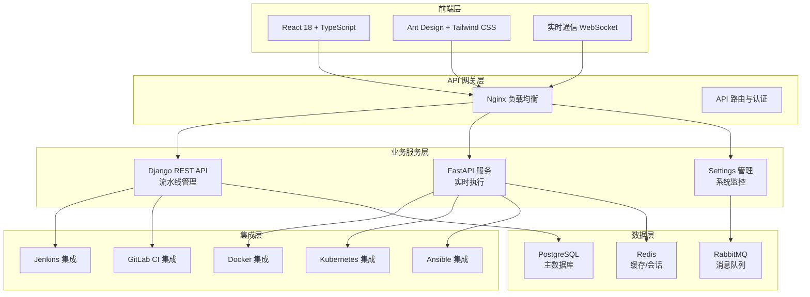

# 🚀 AnsFlow CI/CD 平台

> 基于微服务架构的下一代企业级 CI/CD 平台，致力于通过原子化流水线设计和智能化管理，提供灵活、高效、安全的持续集成与交付解决方案。

[](https://opensource.org/licenses/MIT)
[](https://www.python.org/downloads/)
[](https://reactjs.org/)
[](https://www.docker.com/)
[](https://websockets.spec.whatwg.org/)

## 🎯 项目状态概览

**📅 最新更新**: 2025年7月9日  
**🚀 当前版本**: v1.3.0  
**📈 完成度**: 95% (全功能完善，生产就绪)

### 🎉 最新完成
- ✅ **Docker 系统级 API**: 完整的系统信息获取、资源统计、清理功能
- ✅ **Settings 页面**: 审计日志、系统监控、企业级设置模块全部就绪  
- ✅ **测试组织**: 规范的测试目录结构，完整的调试工具
- ✅ **文档完善**: 开发、部署、API 文档完整

### 📊 开发进度
- ✅ **Phase 1**: 核心执行引擎 (100%)
- ✅ **Phase 2**: 实时监控系统 (100%)  
- ✅ **Jenkins集成**: 工具集成与管理 (100%)
- ✅ **前端现代化**: UI组件与用户体验 (100%)
- ✅ **Phase 3**: 多工具集成与高级功能 (95%)
- ✅ **Docker 集成**: 容器化管理与系统级 API (100%)
- ✅ **Settings 管理**: 企业级设置与监控 (100%)
- 🎯 **下一步**: 性能优化 & 高可用部署

## ✨ 核心特性

### 🎯 原子化流水线设计
- **原子步骤库**: 预定义的可复用构建块
- **可视化编排**: 拖拽式流水线构建
- **动态组合**: 灵活的步骤组装和配置

### 🏗️ 微服务架构
- **Django 管理服务**: 用户管理、流水线编排、审批流程
- **FastAPI 高性能服务**: Webhook 处理、实时推送、外部集成
- **消息队列通信**: 基于 RabbitMQ 的异步解耦

### 🔌 智能集成适配
- **多样化触发源**: Git 仓库、定时任务、手动触发、外部 API
- **丰富的工具集成**: Jenkins、GitLab CI、Docker、Kubernetes、Ansible
- **自动化部署支持**: Ansible playbook执行、主机管理、配置管理
- **灵活的通知机制**: 邮件、Slack、企业微信、自定义 Webhook

### 🛡️ 企业级安全
- **细粒度权限控制**: 基于角色的访问控制 (RBAC)
- **多层审批流程**: 可配置的审批工作流
- **操作审计**: 完整的操作日志和追踪

## 🏗️ 技术架构



## 🚀 快速开始

### 环境要求
- Python 3.8+
- Node.js 16+
- Docker & Docker Compose
- Redis 6+
- PostgreSQL 12+

### 开发环境启动

```bash
# 克隆仓库
git clone https://github.com/your-org/ansflow.git
cd ansflow

# 启动所有服务
make dev-start

# 或者使用 Docker Compose
docker-compose up -d

# 访问应用
open http://localhost:3000
```

### 快速部署

```bash
# 生产环境部署
make prod-deploy

# 使用 Kubernetes
kubectl apply -f deployment/k8s/

# 使用 Helm
helm install ansflow deployment/helm/
```

## 📁 项目结构

```
ansflow/
├── frontend/                 # React 前端应用
│   ├── src/
│   │   ├── components/      # 可复用组件
│   │   ├── pages/           # 页面组件
│   │   ├── services/        # API 服务
│   │   └── types/           # TypeScript 类型
├── backend/                 # Django 后端服务
│   ├── django_service/
│   │   ├── pipelines/       # 流水线管理
│   │   ├── cicd_integrations/ # CI/CD 工具集成
│   │   ├── docker_integration/ # Docker 集成
│   │   ├── kubernetes_integration/ # K8s 集成
│   │   ├── ansible_integration/ # Ansible 集成
│   │   └── settings_management/ # 设置管理
├── deployment/              # 部署配置
│   ├── docker/             # Docker 配置
│   ├── k8s/                # Kubernetes 配置
│   └── helm/               # Helm Charts
├── tests/                   # 测试文件
│   ├── api/                # API 测试
│   ├── integration/        # 集成测试
│   ├── unit/               # 单元测试
│   └── debug/              # 调试脚本
├── docs/                    # 项目文档
│   ├── development/        # 开发文档
│   ├── reports/            # 完成报告
│   └── guides/             # 使用指南
└── scripts/                # 工具脚本
```

## 📋 Todo List

### 🔥 高优先级 (立即开始)
- [ ] **性能优化**
  - [ ] 流水线执行性能优化
  - [ ] 数据库查询优化
  - [ ] 前端组件懒加载
  - [ ] API 响应缓存机制

- [ ] **生产部署准备**
  - [ ] 生产环境配置优化
  - [ ] 安全配置加固
  - [ ] 监控告警系统
  - [ ] 备份恢复方案

### ⚡ 中优先级 (近期完成)
- [ ] **高级功能**
  - [ ] 流水线模板市场
  - [ ] 多租户支持
  - [ ] 高级审批工作流
  - [ ] 流水线分析报表

- [ ] **集成扩展**
  - [ ] Azure DevOps 集成
  - [ ] AWS CodePipeline 集成
  - [ ] 更多通知渠道
  - [ ] 企业级 SSO (LDAP/SAML)

### 📈 低优先级 (长期规划)
- [ ] **AI/ML 功能**
  - [ ] 智能故障诊断
  - [ ] 性能预测分析
  - [ ] 自动化测试推荐
  - [ ] 代码质量评估

- [ ] **扩展功能**
  - [ ] 移动端应用
  - [ ] 插件系统
  - [ ] API 开放平台
  - [ ] 社区版本

## 🔧 开发指南

### 前端开发
```bash
cd frontend
npm install
npm run dev
```

### 后端开发
```bash
cd backend/django_service
pip install -r requirements.txt
python manage.py runserver
```

### 测试
```bash
# 运行所有测试
make test

# API 测试
python tests/api/test_docker_api.py

# 调试模式
python tests/debug/test_settings_debug.py
```

## 📖 文档

- [📚 开发文档](docs/development/)
- [🚀 部署指南](docs/deployment/)
- [📊 API 文档](docs/api/)
- [🔧 故障排除](docs/troubleshooting/)

## 🤝 贡献指南

我们欢迎所有形式的贡献！请阅读 [贡献指南](CONTRIBUTING.md) 了解详情。

### 提交 Issue
- 使用清晰的标题描述问题
- 提供详细的重现步骤
- 包含相关的错误日志

### 提交 Pull Request
- Fork 项目到您的账号
- 创建功能分支 (`git checkout -b feature/AmazingFeature`)
- 提交更改 (`git commit -m 'Add some AmazingFeature'`)
- 推送到分支 (`git push origin feature/AmazingFeature`)
- 开启 Pull Request

## 📜 许可证

本项目采用 MIT 许可证 - 查看 [LICENSE](LICENSE) 文件了解详情。

## 🙏 致谢

感谢所有为此项目做出贡献的开发者！

## 📞 联系我们

- 📧 Email: team@ansflow.dev
- 💬 Slack: [加入我们的 Slack](https://ansflow.slack.com)
- 🐦 Twitter: [@AnsFlowCI](https://twitter.com/AnsFlowCI)

---

⭐ 如果这个项目对您有帮助，请给我们一个 Star！
