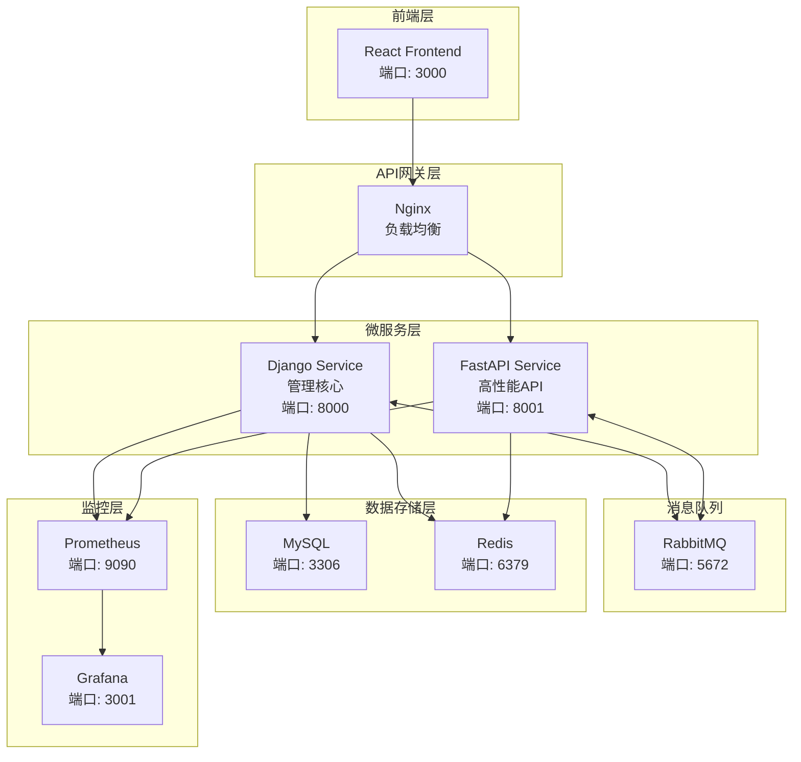

# 🚀 AnsFlow CI/CD 平台

> 基于微服务架构的下一代企业级 CI/CD 平台，致力于通过原子化流水线设计和智能化管理，提供灵活、高效、安全的持续集成与交付解决方案。

[](https://opensource.org/licenses/MIT)
[](https://www.python.org/downloads/)
[](https://reactjs.org/)
[](https://www.docker.com/)

## ✨ 核心特性

### 🎯 原子化流水线设计
- **原子步骤库**: 预定义的可复用构建块
- **可视化编排**: 拖拽式流水线构建
- **动态组合**: 灵活的步骤组装和配置

### 🏗️ 微服务架构
- **Django 管理服务**: 用户管理、流水线编排、审批流程
- **FastAPI 高性能服务**: Webhook 处理、实时推送、外部集成
- **消息队列通信**: 基于 RabbitMQ 的异步解耦

### 🔌 智能集成适配
- **多样化触发源**: Git 仓库、定时任务、手动触发、外部 API
- **丰富的工具集成**: Jenkins、GitLab CI、Docker、Kubernetes
- **灵活的通知机制**: 邮件、Slack、企业微信、自定义 Webhook

### 🛡️ 企业级安全
- **细粒度权限控制**: 基于角色的访问控制 (RBAC)
- **多层审批流程**: 可配置的审批工作流
- **操作审计**: 完整的操作日志和追踪

## 🏗️ 技术架构



## 🚀 快速开始

### 环境要求

- **Docker**: 20.10+
- **Docker Compose**: 2.0+
- **Node.js**: 16+ (本地开发)
- **Python**: 3.8+ (本地开发)

### 一键启动

```bash
# 1. 克隆项目
git clone https://github.com/your-org/ansflow.git
cd ansflow

# 2. 复制环境变量配置
cp .env.example .env

# 3. 启动开发环境
make dev-up

# 4. 初始化数据库
make db-init

# 5. 创建超级用户
make superuser
```

### 访问服务

| 服务 | URL | 说明 |
|------|-----|------|
| 🎨 前端界面 | http://localhost:3000 | React 用户界面 |
| 🔧 Django 管理 | http://localhost:8000/admin | 后台管理界面 |
| ⚡ FastAPI 文档 | http://localhost:8001/docs | API 接口文档 |
| 🐰 RabbitMQ 管理 | http://localhost:15672 | 消息队列监控 |
| 📊 Grafana 监控 | http://localhost:3001 | 系统监控面板 |

默认登录凭据：
- **用户名**: admin
- **密码**: admin123

## 📚 项目结构

```
ansflow/
├── 🔧 backend/                 # 后端微服务
│   ├── django_service/         # Django 管理服务
│   ├── fastapi_service/        # FastAPI 高性能服务
│   └── shared/                 # 共享代码库
├── 🎨 frontend/                # React 前端应用
├── 🚀 deployment/              # 部署配置
│   ├── docker/                 # Docker 配置
│   ├── kubernetes/             # K8s 部署配置
│   ├── terraform/              # 基础设施即代码
│   └── ansible/                # 配置管理
├── 📚 docs/                    # 项目文档
├── 🧪 tests/                   # 集成测试
├── 📊 monitoring/              # 监控配置
└── 🔧 scripts/                 # 工具脚本
```

详细结构说明请参考 [PROJECT_STRUCTURE.md](./PROJECT_STRUCTURE.md)

## 🛠️ 开发指南

### 后端开发

```bash
# 进入 Django 服务目录
cd backend/django_service

# 安装依赖
pip install -r requirements.txt

# 运行开发服务器
python manage.py runserver 8000

# 运行测试
python manage.py test
```

### 前端开发

```bash
# 进入前端目录
cd frontend

# 安装依赖
npm install

# 启动开发服务器
npm run dev

# 运行测试
npm run test

# 构建生产版本
npm run build
```

### 常用命令

```bash
# 开发环境管理
make dev-up          # 启动开发环境
make dev-down        # 停止开发环境
make dev-logs        # 查看日志
make dev-restart     # 重启服务

# 数据库管理
make db-init         # 初始化数据库
make db-migrate      # 运行迁移
make db-seed         # 填充测试数据
make db-backup       # 备份数据库

# 测试相关
make test            # 运行所有测试
make test-backend    # 运行后端测试
make test-frontend   # 运行前端测试
make lint            # 代码检查

# 生产部署
make prod-deploy     # 生产环境部署
make prod-logs       # 生产环境日志
make prod-backup     # 生产环境备份
```

## 📖 文档导航

- [🏗️ 项目结构](./PROJECT_STRUCTURE.md) - 详细的项目组织结构
- [🎯 技术架构分析](./项目说明/技术架构分析报告.md) - 深度技术架构解析
- [🔧 API 文档](./docs/api/) - RESTful API 接口文档
- [🚀 部署指南](./docs/deployment/) - 生产环境部署指南
- [👨‍💻 开发指南](./docs/development/) - 开发环境配置与规范
- [📊 监控指南](./docs/monitoring/) - 系统监控与运维

## 🤝 贡献指南

我们欢迎社区贡献！请遵循以下步骤：

1. **Fork** 本仓库
2. 创建特性分支 (`git checkout -b feature/amazing-feature`)
3. 提交更改 (`git commit -m 'Add some AmazingFeature'`)
4. 推送到分支 (`git push origin feature/amazing-feature`)
5. 开启 **Pull Request**

### 开发规范

- 遵循 [PEP 8](https://www.python.org/dev/peps/pep-0008/) Python 代码规范
- 遵循 [ESLint](https://eslint.org/) JavaScript/TypeScript 代码规范
- 提交信息遵循 [Conventional Commits](https://www.conventionalcommits.org/)
- 确保所有测试通过
- 更新相关文档

## 🔄 版本发布

我们使用 [语义化版本](https://semver.org/) 进行版本管理。查看 [Releases](https://github.com/your-org/ansflow/releases) 了解版本历史。

## 📄 许可证

本项目基于 MIT 许可证开源 - 查看 [LICENSE](LICENSE) 文件了解详情。

## 📞 联系我们

- **项目主页**: https://github.com/your-org/ansflow
- **问题报告**: https://github.com/your-org/ansflow/issues
- **邮箱**: ansflow-team@example.com
- **社区讨论**: https://discord.gg/ansflow

## 🙏 致谢

感谢所有为 AnsFlow 项目做出贡献的开发者和社区成员！

---

**⚡ 让 CI/CD 更简单，让开发更高效 - AnsFlow 与您同行！**
