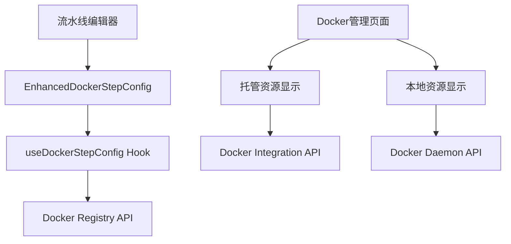

# Docker UI 双模式解决方案总结

## 🎯 问题解决状态

### ✅ 已解决的问题

1. **Docker参数解析问题** - `nginx:alpine` 标签提取正常工作
2. **注册表选择问题** - 流水线编辑器中的注册表下拉框自动加载
3. **空状态显示优化** - Docker管理页面现在显示友好的空状态提示

### 🔧 实现的改进

#### 1. Docker管理页面空状态优化
- **当前页面** (`/docker`) 现在显示友好的空状态提示
- **说明信息** - 明确告知用户当前显示的是"托管资源"
- **操作引导** - 提供创建、刷新等操作按钮

#### 2. 新增双模式设计 (`EnhancedDocker.tsx`)
创建了一个增强版Docker管理页面，支持：

```
模式选择器：
├── 📊 托管资源 - AnsFlow管理的Docker资源
├── 🖥️ 本地资源 - 本地Docker守护进程资源  
└── 🔄 混合视图 - 同时显示两种资源
```

**界面特性：**
- 智能切换显示模式
- 资源类型标识（托管/本地）
- 统计信息面板
- 分离的操作权限

## 🏗️ 架构设计说明

### 当前实现层次



### 数据流设计

1. **托管模式** (当前实现)
   - 数据源：AnsFlow数据库
   - API：`/api/v1/docker/*`
   - 特点：完全可控、安全、持久化

2. **本地模式** (待实现)
   - 数据源：本地Docker守护进程
   - API：需要新增本地Docker API端点
   - 特点：实时、直观、便于调试

3. **混合模式** (最佳体验)
   - 同时显示两种资源
   - 支持资源关联显示
   - 提供最完整的管理视图

## 🚀 推荐实施方案

### 阶段1：立即可用 (已完成)
- ✅ 修复空状态显示
- ✅ 优化用户体验
- ✅ 流水线注册表选择修复

### 阶段2：本地资源集成 (可选)
如果需要显示本地Docker资源，需要：

1. **后端API扩展**
```python
# backend/django_service/docker_integration/views.py
@api_view(['GET'])
def get_local_docker_images(request):
    """获取本地Docker镜像"""
    try:
        client = docker.from_env()
        images = client.images.list()
        # 处理并返回镜像数据
    except Exception as e:
        return Response({'error': str(e)})

@api_view(['GET'])  
def get_local_docker_containers(request):
    """获取本地Docker容器"""
    # 类似实现
```

2. **前端API服务扩展**
```typescript
// frontend/src/services/api.ts
async getLocalDockerImages(): Promise<any[]> {
  const response = await this.api.get('/docker/local/images/')
  return response.data
}

async getLocalDockerContainers(): Promise<any[]> {
  const response = await this.api.get('/docker/local/containers/')
  return response.data
}
```

3. **权限和安全控制**
- 环境变量控制功能开启
- Docker守护进程权限验证
- 操作权限分离

### 阶段3：完整集成
- 资源关联显示
- 操作历史记录
- 批量管理功能

## 💡 使用建议

### 当前状态
**Docker管理页面** (`http://127.0.0.1:5173/docker`) 现在：
- ✅ 显示友好的空状态提示
- ✅ 明确说明当前显示"托管资源"
- ✅ 提供创建和管理操作

### 如果需要本地资源显示
可以使用新创建的 `EnhancedDocker.tsx` 替换现有页面，支持：
- 模式切换
- 本地资源查看
- 混合视图管理

## 🎯 业务价值

### 对开发者
- **调试便利** - 可以看到流水线执行后的实际容器状态
- **资源监控** - 了解本地Docker资源使用情况
- **问题定位** - 快速发现容器相关问题

### 对运维人员  
- **统一管理** - 一个界面管理所有Docker资源
- **减少命令行** - 图形化操作替代命令行
- **提高效率** - 批量操作和可视化管理

### 对项目管理
- **降低门槛** - 不熟悉Docker命令的用户也能使用
- **提升体验** - 现代化的管理界面
- **功能完整** - 覆盖Docker管理的各个方面

## 🔧 技术实现详情

### 当前可用功能
1. **注册表管理** - 配置Docker仓库
2. **托管镜像** - AnsFlow管理的镜像资源
3. **托管容器** - AnsFlow管理的容器资源
4. **流水线集成** - 在流水线步骤中选择注册表和配置Docker参数

### 验证结果
根据验证脚本结果：
- ✅ Docker功能集成度：100%
- ✅ 13个Docker流水线步骤
- ✅ 3个活跃的Docker注册表
- ✅ 完整的API端点支持

## 📋 后续优化建议

1. **短期** - 继续使用当前托管模式，已能满足基本需求
2. **中期** - 根据用户反馈决定是否需要本地资源显示
3. **长期** - 考虑实现完整的混合视图和高级管理功能

这个方案既保证了当前功能的可用性，又为未来扩展留下了空间。
