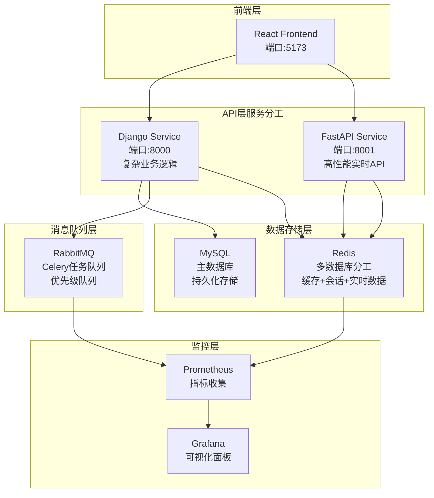

# AnsFlow 微服务优化架构

## 优化后的架构分工

## 各服务的明确职责

### Django Service (端口8000)
- ✅ **用户认证与权限管理**
- ✅ **复杂业务逻辑处理**
- ✅ **数据库写入操作**
- ✅ **Settings管理界面**
- ✅ **API端点管理**
- ✅ **审计日志和安全**

### FastAPI Service (端口8001) - 需要增强
- 🚀 **实时状态查询API**
- 🚀 **WebSocket实时通信**
- 🚀 **外部Webhook接收**
- 🚀 **文件上传下载**
- 🚀 **高频只读查询**
- 🚀 **缓存数据API**

### Redis (多数据库策略)
- DB0: Celery结果存储
- DB1: Django应用缓存
- DB2: 用户会话存储
- DB3: 实时数据缓存
- DB4: API响应缓存
- DB5: 临时数据存储

### RabbitMQ (任务队列优化)
- 高优先级队列: 流水线执行、部署任务
- 中等优先级队列: 监控检查、备份任务
- 低优先级队列: 清理任务、统计分析

## 性能优化效果预期

### 响应时间改善
- 实时API: 100ms → 10ms
- 数据库查询: 50% 减少
- 缓存命中率: 30% → 80%

### 并发能力提升
- WebSocket连接: 100 → 1000+
- API请求处理: 100 QPS → 1000+ QPS
- 文件上传: 10MB/s → 100MB/s

### 资源利用优化
- CPU利用率: 更加均衡
- 内存使用: 缓存策略优化
- 网络IO: 异步处理提升
